<p align="center">
  
</p>

<p align="center">
  <picture>
    <source media="(prefers-color-scheme: light)" srcset="assets/typing-light.svg">
    
  </picture>
</p>

<picture><source media="(prefers-color-scheme: light)" srcset="assets/title-hello-light.svg">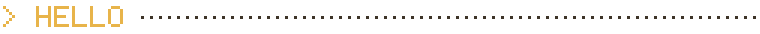</picture>


hi, i'm **ani**.

i work with ai for a living. after hours i work on hobby projects for fun, and on solving problems with technology.

meng in cs from the university of cincinnati. now in las vegas, fuelled by a desire to do something different. something great.

<sub>longer version at <a href="https://www.saianirudh.blog">saianirudh.blog</a></sub>

<br clear="right">

<picture><source media="(prefers-color-scheme: light)" srcset="assets/title-abilities-light.svg">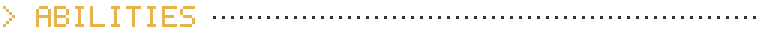</picture>


```
  class ...... ai engineer, product builder
  base ....... las vegas, nv
  status ..... ai fellow at handshake ai
               volunteer engineer at an ngo
               building toki

  ai engineering ....... llm apps and agents,
                         prototype to production
  product building ..... idea to shipped product,
                         end to end
  data + ml pipelines .. pipelines that stay up
                         at 3am
  iot + ml ............. sensors in, decisions out
  interpretability ..... opening models up to see
                         what they compute
```

<br clear="left">

<picture><source media="(prefers-color-scheme: light)" srcset="assets/title-inventory-light.svg">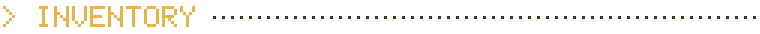</picture>

<p align="center">
  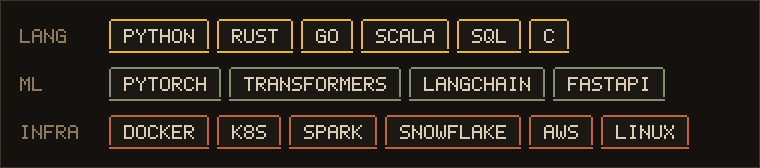
</p>

<picture><source media="(prefers-color-scheme: light)" srcset="assets/title-quest-log-light.svg">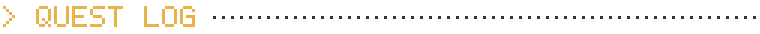</picture>

```
  + completed
    glassbox .... x-ray for medical llms. 15+ sae features
                  live during inference, flags when the
                  model is unsure of itself
    exoseeker ... exoplanets in kepler data, >90% accuracy
                  loot: best use of nasa data, space apps
    needlehelp .. iot + ml for real-time robotic control
                  loot: 1st of 140 teams, ohio's largest
                  hackathon
    aquaponics .. taught a working fish farm to run itself
                  1,000 readings a day, 40% less
                  babysitting, 20% more yield
```

<picture><source media="(prefers-color-scheme: light)" srcset="assets/title-xp-log-light.svg">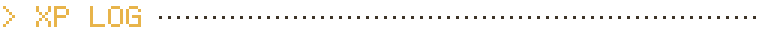</picture>

<!-- ALMANAC:START -->

```
  ── the almanac · 2026 ──────────────

   jan  ░░░░░░░░░░░░░░░░    0
   feb  ░░░░░░░░░░░░░░░░    0
   mar  █░░░░░░░░░░░░░░░    1
   apr  ███░░░░░░░░░░░░░   26
   may  ███░░░░░░░░░░░░░   20
   jun  █████░░░░░░░░░░░   38
   jul  ████████████████  127
   aug  ████████████░░░░   95
   sep  █████████░░░░░░░   74
   oct  ░░░░░░░░░░░░░░░░    0

  ────────────────────────────────────
   busiest month .. jul
   longest streak . 7 days
   total .......... 381
```

<!-- ALMANAC:END -->

<picture><source media="(prefers-color-scheme: light)" srcset="assets/title-pizza-break-light.svg">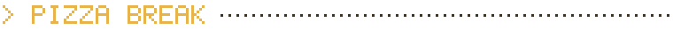</picture>

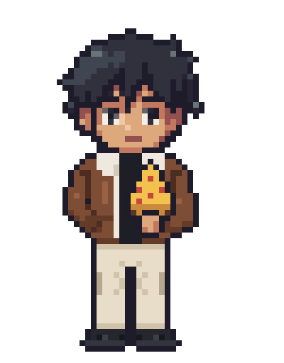

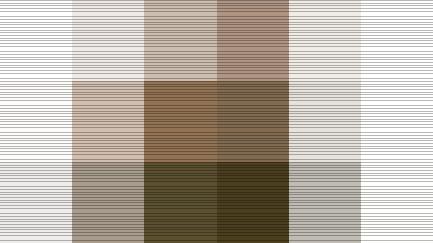

<sub>what's on while i eat. 10/10 recommend</sub>

<br clear="right">

<picture><source media="(prefers-color-scheme: light)" srcset="assets/title-say-hi-light.svg">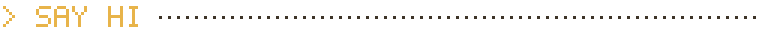</picture>

looking for an ai engineer, or someone to build a product with? or just want to say hi and grab a coffee? reach out.

<a href="https://www.saianirudh.blog">saianirudh.blog</a> · <a href="https://www.linkedin.com/in/sai-anirudh-siddi/">linkedin</a> · <a href="mailto:siddish@mail.uc.edu">email</a> · <a href="https://github.com/Anirudh64210/Anirudh64210/issues/new?title=hello&body=say+something">sign the guestbook</a>

<p align="center">
  
</p>
